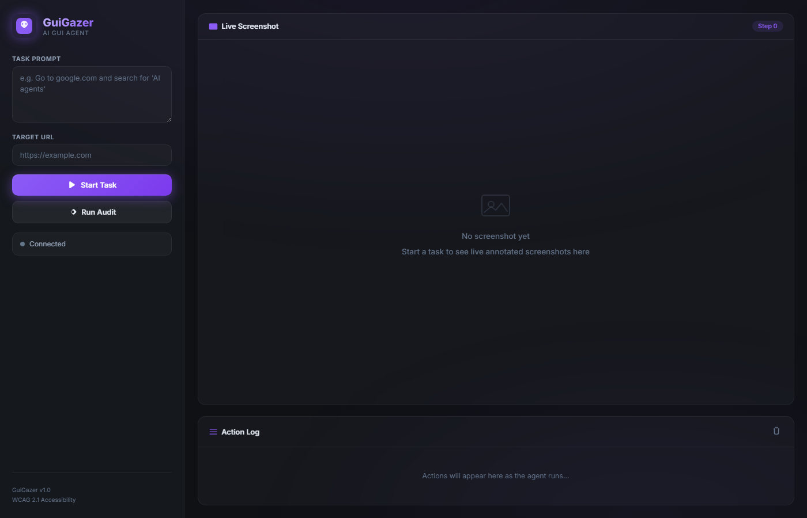
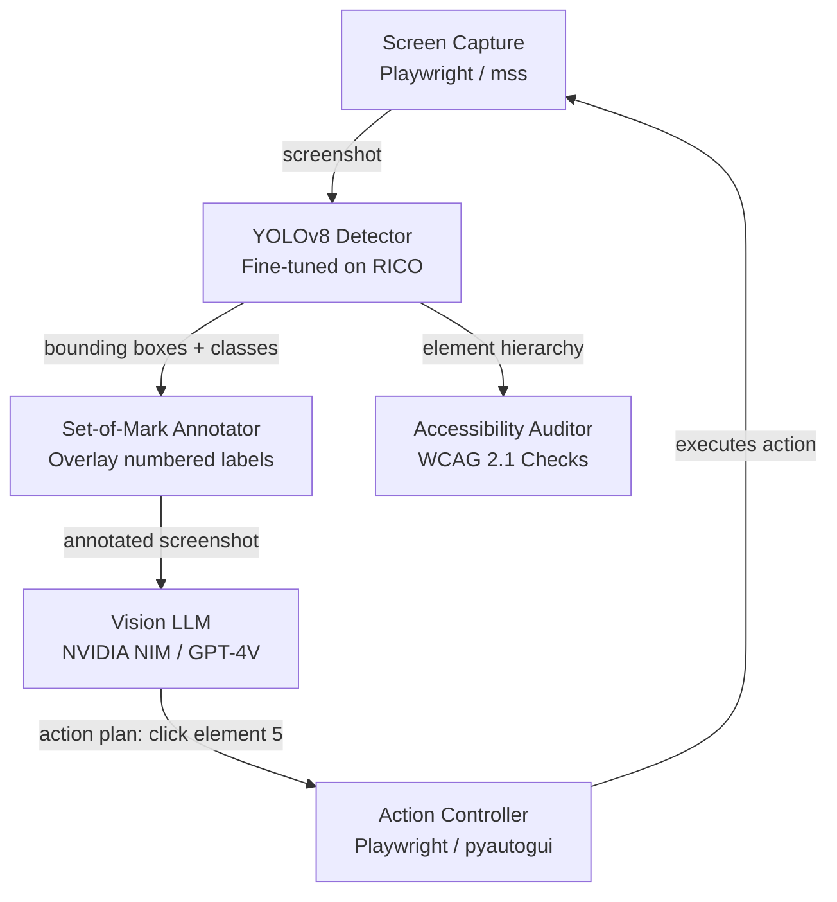
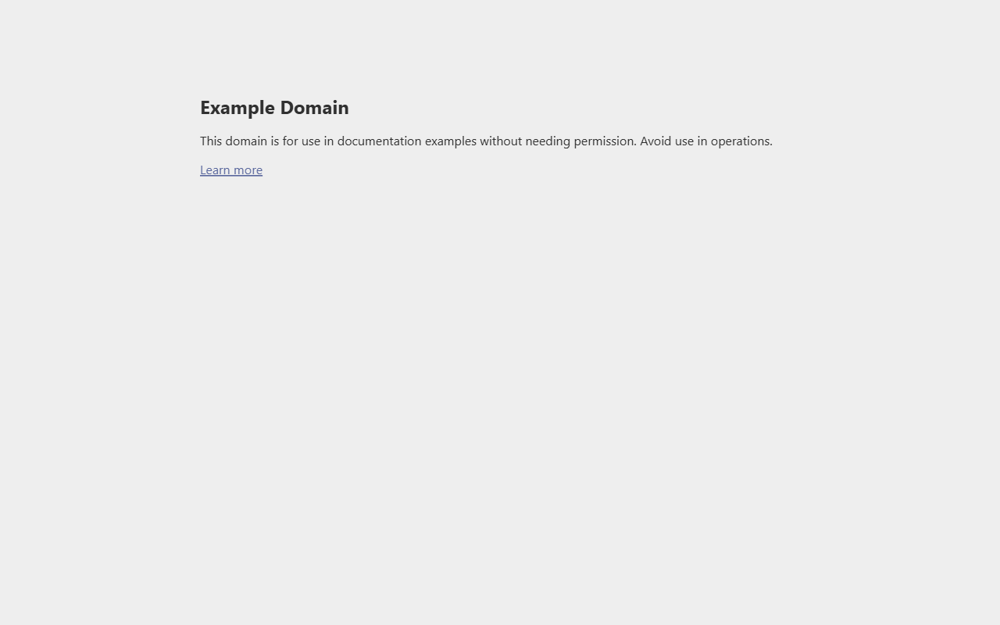

<div align="center">
  
# 👁️ GuiGazer

**An on-device GUI automation agent using fine-tuned YOLOv8 visual grounding and multimodal LLM reasoning (NVIDIA NIM / GPT-4V).**

[](https://www.python.org)
[](https://fastapi.tiangolo.com)
[](https://ultralytics.com)
[](https://playwright.dev)



</div>

## 🤔 What It Does

GuiGazer is an intelligent, on-device computer-use agent that automates tasks on websites and native applications. It "gazes" at your screen, detects every interactive UI element, and reasons about what to click or type next.

By combining **Computer Vision (YOLOv8)** for precise UI element detection with the reasoning capabilities of **Vision Language Models (GPT-4V / NVIDIA NIM)**, it parses unstructured interfaces into actionable steps. 

It can be used to:
1. **Automate Web/Desktop Tasks:** Tell it "Search for Python tutorials" and it will navigate, type, and click autonomously.
2. **Audit Accessibility:** Automatically evaluate web pages for WCAG compliance (contrast ratios, minimum touch targets, missing labels).

---

## 🏗️ Architecture & How It Works

GuiGazer uses a hybrid perception and reasoning pipeline:



1. **Capture:** Playwright takes a full-page screenshot of the target application.
2. **Detect:** YOLOv8 (fine-tuned on the RICO dataset) identifies 12 distinct classes of UI elements (buttons, inputs, dropdowns, etc.).
3. **Annotate:** The system draws numbered Set-of-Mark (SoM) bounding boxes over the image so the LLM doesn't have to guess coordinates.
4. **Reason:** The Vision LLM receives the annotated image and user prompt, and decides which numbered element ID to interact with.
5. **Act:** The controller translates the element ID back to `(x, y)` coordinates and executes the click/type action.



---

## ⚡ How To Use (1-Click Quickstart)

1. **Clone & Setup:**
   ```bash
   pip install -r requirements.txt
   playwright install chromium
   ```

2. **Configure API Key:**
   Rename `.env.example` to `.env` and add your NVIDIA API Key (or OpenAI key).
   ```env
   NVIDIA_API_KEY=nvapi-your-key-here
   ```

3. **Launch the Dashboard:**
   Run the `start.bat` file (or `python main.py` directly).
   Open [http://localhost:8001](http://localhost:8001) in your browser!

4. **Run a Task:**
   - Type a task like "Search for AI tutorials" in the prompt box.
   - Watch the agent annotate the screen and execute the steps live!

---

## 📊 Training the Detector

To improve detection accuracy on your own UI components, you can fine-tune the YOLOv8 model:

```bash
# Generate synthetic dataset and train for 50 epochs
python -m detector.train --epochs 50
```

The best weights are automatically saved to `detector/checkpoints/guigazer_yolov8n.pt`.

## 🛡️ License
MIT License
